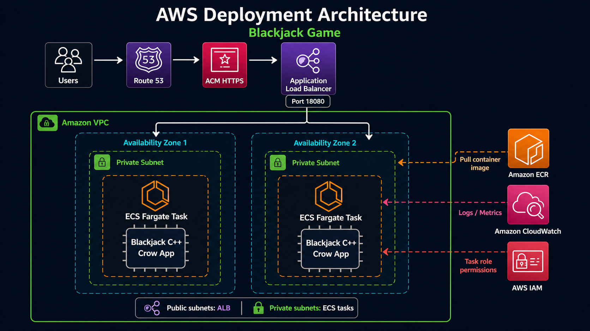

# Blackjack Game

A C++ blackjack game with two ways to play:

- a console version for quick terminal games
- a Crow-powered web version with a simple HTML/CSS/JavaScript interface

The game supports finite multi-deck play, infinite-deck simulation, dealer play, hidden dealer cards, hand scoring with aces, and basic-strategy recommendations.

## Features

- Console and browser gameplay
- Finite deck mode with automatic reshuffle
- Infinite deck mode
- Blackjack scoring with soft ace handling
- Dealer logic that hits below 17
- Strategy helper for hard totals, soft totals, and pairs
- Web API endpoints for starting, hitting, standing, and reading state
- Included Windows build script for the web server

## Project Structure

```text
.
|-- main.cpp              # Console entry point
|-- web_main.cpp          # Crow web server and API routes
|-- blackjack.h           # Main game logic
|-- deck.h                # Deck/shoe handling
|-- hand.h                # Hand scoring and helpers
|-- card.h                # Card value model
|-- player.h              # Player wrapper around a hand
|-- strategy.h            # Basic strategy tables
|-- index.html            # Web UI markup
|-- style.css             # Web UI styling
|-- script.js             # Web UI behavior
|-- build_web.bat         # Windows build script for web version
|-- crow_all.h            # Crow single-header dependency
`-- include/              # Standalone ASIO headers
```

## Requirements

- Windows
- `g++` with C++17 support, such as MSYS2 MinGW
- A modern web browser for the web version

The repository includes Crow and standalone ASIO headers, so no package manager is required for the current Windows build.

## Build the Web Version

From PowerShell or Command Prompt:

```powershell
cd "path\to\Blackjack-game"
.\build_web.bat
```

This creates:

```text
web_blackjack.exe
```

The build command used by the script is:

```powershell
g++ web_main.cpp -o web_blackjack.exe -Iinclude -DASIO_STANDALONE -lws2_32 -lmswsock -O2 -std=c++17
```

## Run the Web Version

```powershell
.\web_blackjack.exe
```

Then open:

```text
http://127.0.0.1:18080
```

## Run the Console Version

Build:

```powershell
g++ main.cpp -o blackjack.exe -std=c++17
```

Run:

```powershell
.\blackjack.exe
```

You can choose finite deck mode or infinite deck mode when the program starts.

## Web API

The web server exposes a small JSON API.

### Start a Game

```http
POST /api/start
Content-Type: application/json
```

Example body:

```json
{
  "decks": 2,
  "infinite": false
}
```

Example PowerShell request:

```powershell
Invoke-RestMethod -Uri http://127.0.0.1:18080/api/start `
  -Method Post `
  -ContentType "application/json" `
  -Body '{"decks":2,"infinite":false}'
```

Example response:

```json
{
  "playerHand": [5, 4],
  "dealerHand": [9, 0],
  "playerScore": 9,
  "dealerScore": 0,
  "gameOver": false,
  "message": "Game started",
  "recommendation": "HIT"
}
```

`0` in `dealerHand` means the dealer hole card is hidden.

### Hit

```http
POST /api/hit
```

Draws one card for the player and returns the updated game state.

### Stand

```http
POST /api/stand
```

Finishes the dealer turn and returns the final result.

### Current State

```http
GET /api/state
```

Returns the current game state.

## AWS Deployment Architecture

The web version is a single C++ HTTP server that serves both the static frontend and JSON API. The simplest AWS deployment is to package the compiled server in a container and run it on Amazon ECS Fargate behind an Application Load Balancer.



```text
Users
  |
  v
Amazon Route 53
  |
  v
AWS Certificate Manager
  |
  v
Application Load Balancer
  |
  v
Amazon ECS Fargate Service
  |
  v
Blackjack C++ Crow container
  |
  +-- Serves index.html, style.css, script.js
  +-- Serves /api/start, /api/hit, /api/stand, /api/state

Supporting services:

Amazon ECR          stores the Docker image
Amazon CloudWatch   stores logs and metrics
AWS IAM             controls task execution permissions
Amazon VPC          isolates networking across public/private subnets
```

### Recommended AWS Components

- **Amazon ECR**: stores the Docker image for the C++ web server.
- **Amazon ECS Fargate**: runs the container without managing EC2 instances.
- **Application Load Balancer**: exposes the game over HTTP/HTTPS and forwards traffic to ECS.
- **Route 53**: optional custom domain, such as `blackjack.example.com`.
- **AWS Certificate Manager**: free TLS certificate for HTTPS.
- **CloudWatch Logs**: centralized server logs.
- **IAM Roles**: least-privilege permissions for pulling images and writing logs.
- **VPC with subnets**: public subnets for the load balancer and private subnets for the ECS tasks.

### Deployment Structure

A production-ready repository can be expanded like this:

```text
.
|-- app/
|   |-- web_main.cpp
|   |-- blackjack.h
|   |-- deck.h
|   |-- hand.h
|   |-- card.h
|   |-- player.h
|   |-- strategy.h
|   |-- index.html
|   |-- style.css
|   `-- script.js
|-- infra/
|   |-- terraform/
|   |   |-- main.tf
|   |   |-- variables.tf
|   |   |-- outputs.tf
|   |   `-- ecs.tf
|   `-- cloudformation/
|       `-- template.yml
|-- docker/
|   `-- Dockerfile
|-- scripts/
|   |-- build-image.ps1
|   |-- push-image.ps1
|   `-- deploy.ps1
|-- README.md
`-- build_web.bat
```

The current repository is still simple and Windows-focused, so the deployment files above are a suggested structure rather than files that already exist.

### Container Deployment Flow

1. Build a Linux container image for the Crow server.
2. Push the image to Amazon ECR.
3. Deploy an ECS Fargate service using that image.
4. Attach the ECS service to an Application Load Balancer target group.
5. Point Route 53 to the load balancer.
6. Use CloudWatch Logs to monitor requests and errors.

### Example Dockerfile

```dockerfile
FROM gcc:14 AS build

WORKDIR /app
COPY . .

RUN g++ web_main.cpp \
    -o web_blackjack \
    -Iinclude \
    -DASIO_STANDALONE \
    -pthread \
    -O2 \
    -std=c++17

FROM debian:bookworm-slim

WORKDIR /app
COPY --from=build /app/web_blackjack .
COPY --from=build /app/index.html .
COPY --from=build /app/style.css .
COPY --from=build /app/script.js .

EXPOSE 18080
CMD ["./web_blackjack"]
```

For AWS, the container should listen on port `18080`, and the ECS target group should forward traffic to the same container port.

### Security Notes

- Use HTTPS at the load balancer with an ACM certificate.
- Keep ECS tasks in private subnets when possible.
- Allow inbound public traffic only to the load balancer.
- Allow the ECS task security group to receive traffic only from the load balancer security group.
- Store secrets in AWS Secrets Manager or SSM Parameter Store if future features need credentials.
- Avoid committing AWS credentials or local `.env` files.

## Gameplay Notes

- Card values are numeric.
- Face cards are represented as `10`.
- Aces are represented as `11`, then counted as `1` automatically when needed.
- The dealer's second card is hidden until the player busts or stands.
- Recommendations come from the strategy tables in `strategy.h`.

## Development Notes

Quick syntax checks:

```powershell
g++ -fsyntax-only main.cpp -std=c++17
g++ -fsyntax-only web_main.cpp -Iinclude -DASIO_STANDALONE -std=c++17
```

The web server listens on port `18080` by default. You can change this in `web_main.cpp`.
